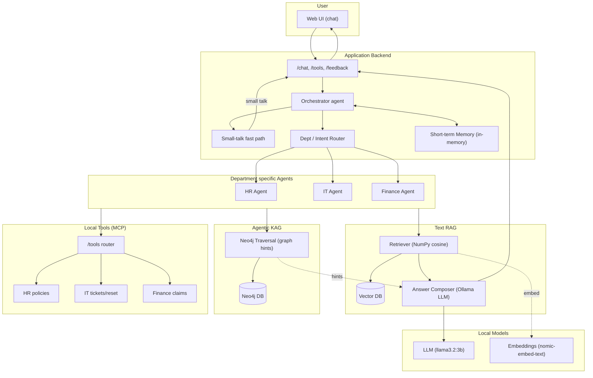

# Virtual Multi-Agent Prototype (Local LLM via Ollama)

## Overview
- Multi-agent prototype for ITSM (HR, IT, Finance)
- Retrieval-Augmented Generation (dept KBs), Agentic KAG (Neo4j) hints, MCP-like local tools
- Local only: uses Ollama

## Design


## Prerequisites
- macOS
- Python 3.11+ (venv)
- Ollama installed and running on 127.0.0.1:11434
  - `brew install ollama`
  - `ollama serve` (or `brew services start ollama`)
  - `ollama pull llama3.2:3b`
  - `ollama pull nomic-embed-text`

## Setup
```bash
cd ~/<proj_dir>
python3 -m venv .venv && source .venv/bin/activate
pip install --upgrade pip setuptools wheel
pip install -r requirements.txt
cp ENV.example .env
# Optional performance/env overrides
export OLLAMA_HOST=http://127.0.0.1:11434
export OLLAMA_CHAT_MODEL=llama3.2:3b
export OLLAMA_NUM_PREDICT=256
export OLLAMA_NUM_CTX=1024
export OLLAMA_TEMPERATURE=0.2
export RETRIEVE_K=2
```

## Prepare data and build indices
- Put your department docs under `data/hr`, `data/it`, `data/finance` as `.md` or `.txt`.
- Build indices (uses local embeddings):
```bash
.venv/bin/python -m app.retrieval.ingest data/hr data/it data/finance
```

## Run
```bash
.venv/bin/uvicorn app.main:app --reload
```

## Web UI
- Open `http://127.0.0.1:8000` for the chat interface (banner, chat bubbles, feedback buttons).
- Small-talk (hello/thanks/etc.) returns instantly via a fast path.
- Conversation memory: each tab uses a unique `conversation_id` to maintain short-term context.

## Local Tools (MCP)
- Mounted under `/tools`:
  - HR: `GET /tools/hr/policies/{id}`, `GET /tools/hr/policies?q=...`
  - IT: `POST /tools/it/tickets`, `POST /tools/it/reset_password`
  - Finance: `POST /tools/finance/claims`

## Neo4j (Agentic KAG) – optional
```bash
brew install neo4j
brew services start neo4j
.venv/bin/python -m app.kag.seed  # seed small demo graph
```

## Test (API)
- Ask a question (dept auto-classified):
```bash
curl -s -X POST localhost:8000/chat -H 'Content-Type: application/json' \
  -d '{"text":"How many vacation days can I carry over?"}' | jq
```
- Force a department:
```bash
curl -s -X POST localhost:8000/chat -H 'Content-Type: application/json' \
  -d '{"text":"Reset my password","dept":"it"}' | jq
```
- Create a ticket via tools path (through agent intent):
```bash
curl -s -X POST localhost:8000/chat -H 'Content-Type: application/json' \
  -d '{"text":"Please create a ticket: VPN not working"}' | jq
```

## Notes
- Retrieval: NumPy cosine similarity; indices in `.indices/<dept>`. Default fanout `RETRIEVE_K=2` (override via env).
- KAG: Neo4j traversal provides graph hints, merged into context.
- Memory: short-term per `conversation_id` (last few turns) prepended as context.
- Observability: `/chat` returns `trace_id` and basic timings (not shown in UI by default).
